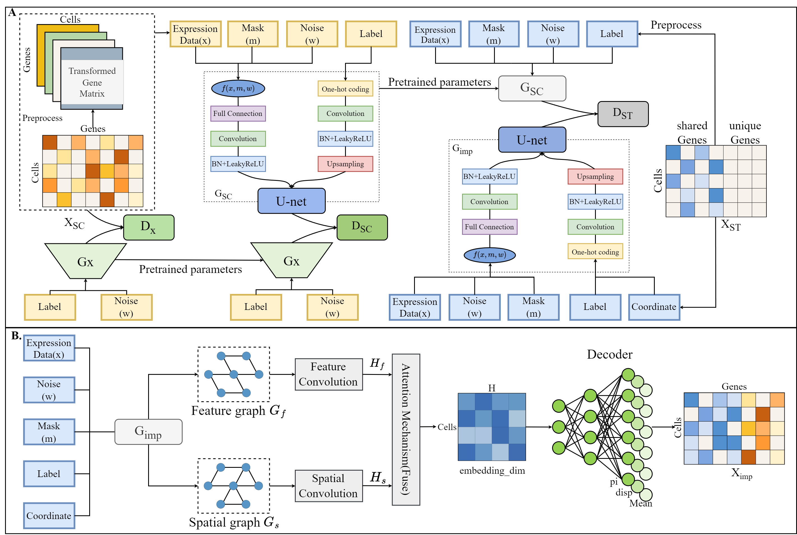

# STGNET:STGNET: Imputation of spatial transcriptome based on imaging techniques using deep generative adversarial and graph convolutional networks
The rapid advancement of spatial transcriptomics provides a unique spatial perspective on tissue structure. Image-based methods like seqFISH and MERFISH offer single-cell resolution but are limited to detecting a restricted number of genes, which may impede a comprehensive view of gene spatial distribution.
Regarding these issues, many methods for enhancing ST data have been proposed based on the similarity between ST cells and reference single-cell RNA sequencing (scRNA-seq) cells. In contrast, we utilize generative adversarial network (GAN) to learn the underlying data distribution of scRNA-seq (SC) data and extract abundant feature information from both SC and ST data respectively. Then, we use a multi-view graph convolutional network (GCN) with an attention mechanism to aggregate node information, thus obtaining accurately enhanced ST data. 
# Description
The input to STGNET is a pre-processed count single cell matrix, with columns representing cells and rows representing genes. It's output is an imputed count matrix with the same dimension. The complete pipeline and the datasets used in the paper is described with the following image.

